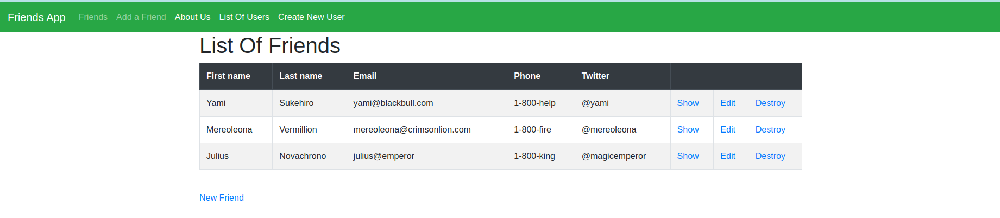

# Forms Project

> In this project we created a Form to gather information such as
> First Name, Last Name, Email, Phone, Twitter

Additional description about the project and its features.

## Built With

- Ruby
- Ruby on Rails
- Bootstrap

## Live Demo

-

## Getting Started

**First get at copy of the project by clicking on the green button on the top right corner**
**On your local machine run this command `git clone git@github.com:410AngelaVu/Forms-Project.git`
then type `cd Forms-Project` and that will get you inside the project. **

### Prerequisites

- Need to have Ruby install
- Rails
- Use the Starter Template from Bootstrap

### Install

    Run `bundle install` to install of the gems and dependecies for the project to run
    Before you use the projec run `rails db:migrate` to get all of the table for the database ready
    To run the application just run `rails s` and open a brower and go to localhost:3000 and you will see the app

## Authors

👤 **Angela Vukadinovic**

- GitHub: [@410AngelaVu](https://github.com/410AngelaVu)
- Twitter: [andjelavukadin](https://twitter.com/andjelavukadin7)
- LinkedIn: [Angela Vukadinovic](https://www.linkedin.com/in/angela-vukadinovic-67a21b1b2/)

👤 **Cosmel Villalboos**

- Github: [@cvilla714](https://github.com/cvilla714)
- Twitter: [@kckeyti](https://twitter.com/kckeyti)
- Linkedin: [Cosmel Villalobos](https://www.linkedin.com/in/cosvilla/)

## 🤝 Contributing

Contributions, issues, and feature requests are welcome!

Feel free to check the [issues page](issues/).

## Show your support

Give a ⭐️ if you like this project!
